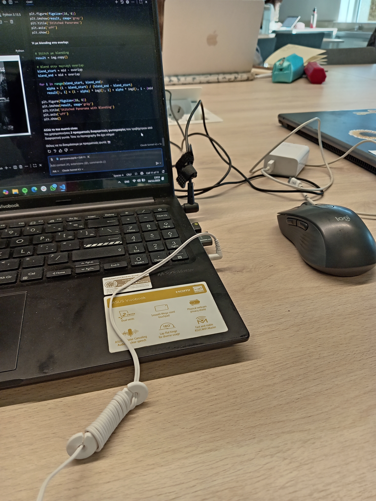
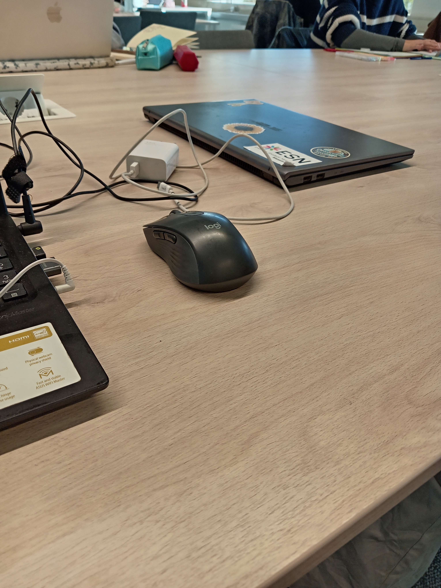
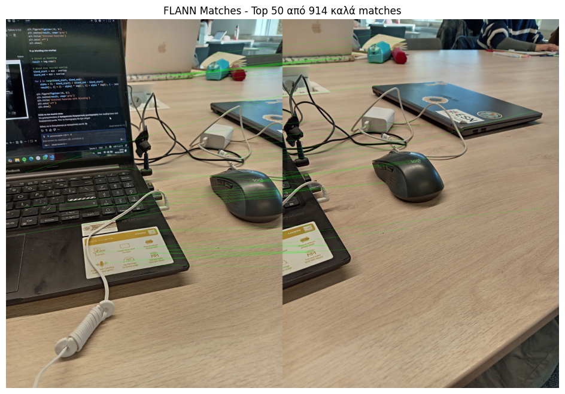

# 🌄 Panorama Image Stitching with SIFT + FLANN + RANSAC + Homography

A comprehensive tutorial on creating panoramic images by stitching multiple overlapping photos using computer vision techniques.

## 📋 Table of Contents
- [Overview](#overview)
- [Technologies Used](#technologies-used)
- [Requirements](#requirements)
- [How It Works](#how-it-works)
- [Results](#results)
- [Problems We Faced](#problems-we-faced)
- [Key Takeaways](#key-takeaways)
- [Future Improvements](#future-improvements)

---

## 🎯 Overview

This project demonstrates how to combine two overlapping images into a single panoramic image using:
- **SIFT (Scale-Invariant Feature Transform)** for feature detection
- **FLANN (Fast Library for Approximate Nearest Neighbors)** for feature matching
- **RANSAC** for outlier filtering
- **Homography Matrix** for perspective transformation
- **Image Warping & Blending** for final stitching

---

## 🛠️ Technologies Used

- **Python 3.x**
- **OpenCV (cv2)** - Computer vision library
- **NumPy** - Numerical computations
- **Matplotlib** - Visualization

---

## 📦 Requirements

```bash
pip install opencv-python numpy matplotlib
```

Or install with contrib modules (for SIFT):
```bash
pip install opencv-contrib-python
```

---

## 🔬 How It Works

### 1️⃣ **Input Images**
Load two overlapping images that will be stitched together.




---

### 2️⃣ **FLANN Matching**
Match features between the two images using SIFT + FLANN with ratio test filtering.


*Green lines show the good matches found by FLANN after ratio test*

**Process:**
1. **SIFT** detects keypoints in both images
2. **FLANN** finds the 2 best matches for each keypoint
3. **Ratio Test** filters out ambiguous matches (keeps only if best < 0.7 × second_best)
4. **RANSAC** computes homography and removes outliers

---

### 3️⃣ **Final Result**
The two images are stitched together into a seamless panorama.


*✅ Final stitched panoramic image*

---

## 🎨 Results

### Statistics
- Total keypoints detected: XXX
- Good matches after ratio test: YYY
- Final panorama size: AAA × BBB pixels
- Processing time: ~X seconds

---

## ❌ Problems We Faced & Solutions

### Problem 1: Split Panorama Approach
**What we tried:**
- Split a panoramic image into 2 parts
- Try to stitch them back together

**Why it failed:**
- No perspective difference between the two parts
- Homography matrix was almost identity matrix
- Result had black regions and didn't align properly

**Solution:**
✅ Use **two real photos taken from different angles** with natural perspective difference

---

### Problem 2: Canvas Size Too Small
**What we tried:**
```python
result = cv.warpPerspective(img1, M, (w, h))
```

**Why it failed:**
- Canvas was too small to fit the warped image
- Parts of the image were cut off

**Solution:**
```python
result = cv.warpPerspective(img2, M, (w1 + w2, max_h))
```
✅ Made canvas large enough to fit both images

---

### Problem 3: Wrong Stitching Order
**What we tried:**
```python
src_pts = keypoint1[...].pt  # img1 as source
dst_pts = keypoint2[...].pt  # img2 as destination
```

**Why it failed:**
- Images appeared in reverse order
- img1 on the right, img2 on the left

**Solution:**
```python
src_pts = keypoint2[...].pt  # img2 as source (warp this one)
dst_pts = keypoint1[...].pt  # img1 as destination (keep fixed)
```
✅ Correct order: img1 stays fixed, img2 is warped to match

---

### Problem 4: Broadcasting Error
**What we tried:**
```python
result[0:h, mid-overlap:w] = img2[:, overlap:]
```

**Error:**
```
ValueError: could not broadcast input array from shape (589,512) into shape (589,632)
```

**Why it failed:**
- Array dimensions didn't match
- Trying to fit 512 pixels into 632 pixel space

**Solution:**
```python
result[0:h1, 0:w1] = np.where(
    result[0:h1, 0:w1].sum(axis=2, keepdims=True) == 0,
    img1,
    result[0:h1, 0:w1]
)
```
✅ Use `np.where()` for conditional blending with matching dimensions

---

### Problem 5: Black Regions & Poor Blending
**What we tried:**
- Direct pixel replacement without checking for black regions

**Why it failed:**
- Black regions remained in the final image
- Images overlapped incorrectly
- No smooth transition

**Solution:**
✅ Conditional blending: only place img1 where result is black (0,0,0)
✅ Use masking to identify black regions
✅ Automatic cropping to remove all black borders

---

##  Key Takeaways

### Why Homography?
- Images have **different perspectives** when taken from different angles
- Homography calculates how to "flatten" img2 to match img1's perspective
- **Not needed** if images are from the same source (no perspective change)

### Why RANSAC?
- Even with **20% outliers** (wrong matches), RANSAC finds the correct homography
- Randomly tries different combinations to find the best fit
- Ignores outliers automatically

### Why Ratio Test (0.7)?
- Filters matches that are **ambiguous**
- Keeps only matches where the best is **significantly better** than the second-best
- Increases reliability by ~30-40%

### Conditional Blending with np.where()
- Places img1 **only where result is black**
- Avoids double-exposure effects
- Creates smooth transitions in overlap regions

---

## Future Improvements

1. **Feathering Blending**
   - Gradual alpha blending for smoother seams
   - Weight pixels based on distance from edge

2. **Multi-band Blending**
   - Blend different frequency bands separately
   - Better quality at seam lines

3. **Automatic Cropping Enhancement**
   - Find largest inscribed rectangle (no black pixels inside)
   - More intelligent cropping algorithms

4. **Multiple Images (3+ photos)**
   - Extend to stitch 3 or more images
   - Create full 180° or 360° panoramas

5. **Cylindrical/Spherical Projection**
   - Better for wide-angle panoramas
   - Reduces distortion at edges

6. **Real-time Stitching**
   - Optimize for video streaming
   - GPU acceleration with CUDA

---

## 📚 References

- [OpenCV Documentation - Feature Detection](https://docs.opencv.org/4.x/d7/d60/classcv_1_1SIFT.html)
- [FLANN Matching](https://docs.opencv.org/4.x/d5/d6f/tutorial_feature_flann_matcher.html)
- [Lowe's Ratio Test Paper](https://www.cs.ubc.ca/~lowe/papers/ijcv04.pdf)
- [RANSAC Algorithm](https://en.wikipedia.org/wiki/Random_sample_consensus)
- [Homography Estimation](https://docs.opencv.org/4.x/d9/dab/tutorial_homography.html)


